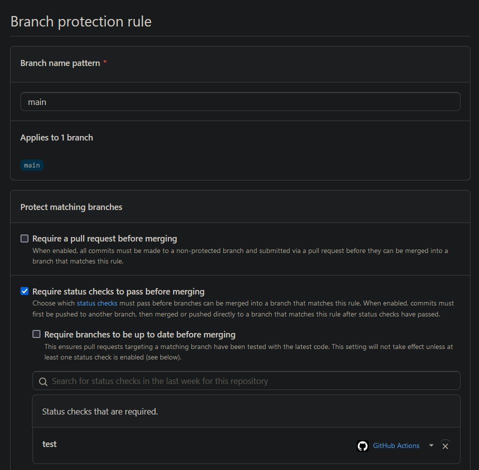
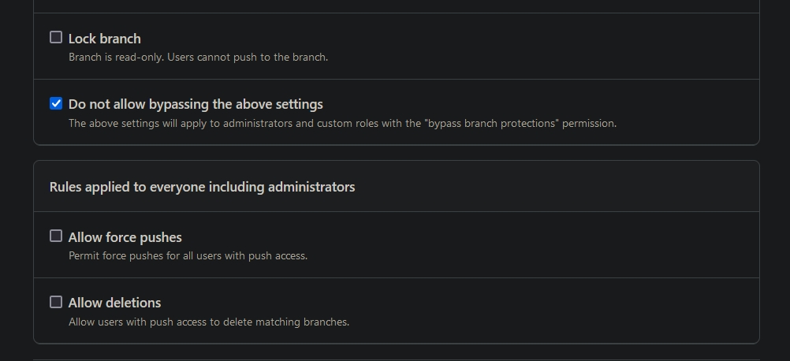

# YOLOv3-nano Demo

This is the demo of a highly compact `You Only Look Once` Convolutional Neural Network for Object Detection

## Week 2

Branches "Week-1.1" and "Week-1.2" reproduce the assignments of "Week 1":

https://github.com/aleksei-andreev/Machine-Learning-in-Computer-Vision/tree/Week-1.1

https://github.com/aleksei-andreev/Machine-Learning-in-Computer-Vision/tree/Week-1.2


Branch "Week-2.1" reproduces the first assignment of "Week 2":

https://github.com/aleksei-andreev/Machine-Learning-in-Computer-Vision/tree/Week-2.1


This branch reproduces the second assignment of "Week 2"

## Create a virtual environment

TensorFlow requires Python 3.7-3.10 to be installed

**Linux/macOS:**

To manage different Python versions and virtual environments you may install `pyenv` using the official guide: https://github.com/pyenv/pyenv#installation/

Install Python 3.8.9:

```
    pyenv install 3.8.9
```

Create and activate virtual environment:

```
    pyenv virtualenv 3.8.9 venv

    pyenv activate venv
```

**Windows:**

To manage different Python versions and virtual environments, you may install `conda` using the official guide: https://docs.conda.io/projects/conda/en/latest/user-guide/install/windows.html

Then create and activate virtual environment:

```
    conda create -n venv python=3.8.8

    conda activate venv
```

## Install the package from a local copy of the repository

### Download the materials

You may download all the materials needed by either downloading the ZIP file or by cloning the git repository

**ZIP file:**

To download the ZIP file click `Code` -> `Download ZIP` in your browser being on the branch page, then unpack it to the desired location on your hard drive

**git:**

In case `git` is not yet installed on your operating system you may install it using the official guide: https://github.com/git-guides/install-git

Clone this branch using git:

```
git clone --branch Week-2.1 https://github.com/aleksei-andreev/Machine-Learning-in-Computer-Vision.git
```

After getting all the materials needed change the current working directory:

```
cd Machine-Learning-in-Computer-Vision
```

### Build the package

The package is already built, but it is possible to build it yourself. To do so you must have the `build` package installed. If you don't have it, you may install it:

```
    pip install build
```

Then build the package:

**Linux/macOS:**

```
    python3 -m build
```

**Windows:**

```
    python -m build
```

Finally, install the main package:

```
    pip install dist/MachineLearninginComputerVision-0.2.0.tar.gz
```

## Install the package directly from the repository

Use the following code to install the package directly from the repository without downloading all the materials:

```
    pip install git+https://github.com/aleksei-andreev/Machine-Learning-in-Computer-Vision.git@Week-2.1
```

## Run the script

To run the script just use the command below:

```
    demo
```

## Setup the project for the local development

You may skip everything before `pre-commit`, because it has all these tools already included. But it is possible to make all the checks separately from the beginning

### Code formatter

You must have the `black` package installed. If you don't have it, you may install it:

```
    pip install black
```

Configurations for this tool may be seen in the `pyproject.toml` file

Run the tool using:

```
    black .
```

Be aware that errors found by this tool will be fixed automatically

### Import sorting

You must have the `isort` package installed. If you don't have it, you may install it:

```
    pip install isort
```

Configurations for this tool may be seen in the `pyproject.toml` file

Run the tool using:

```
    isort .
```

Be aware that errors found by this tool will be fixed automatically

### Linter

You must have the `flake8` package installed. If you don't have it, you may install it:

```
    pip install flake8
```

Configurations for this tool may be seen in the `setup.cfg` file

Run the tool using:

```
    flake8 .
```

Be aware that errors found by this tool must be fixed manually

### Pre-commit

You must have the `pre-commit` package installed. If you don't have it, you may install it:

```
    pip install pre-commit
```

Configurations for this tool may be seen in the `.pre-commit-config.yaml` file

Then install all the git hooks needed for this tool:

```
    pre-commit install
```

From now on every commit will be checked by this tool

Run the tool without committing using:

```
    pre-commit run -a
```

### Local testing

You must have the `pytest` package installed. If you don't have it, you may install it:

```
    pip install pytest
```

Run the tests by:

```
    pytest
```

Test cases are located in `tests/test_demo.py`

* `test_regression()` uses single image that checks that results are always the same and nothing is being corrupted by some changes in the code;

* `test_correct_sizes()` verifies that there are no errors when dealing with different sizes of an image;

* `test_same_result()` makes sure that a new run of the model on the same image gives the identical result and there is no any randomization

## Continuous integration [CI] pipeline

Firstly, you should add a branch protection rule in order to prevent the branch with failed tests to be merged with your base branch. It could be done by going to *Settings -> Branches [Code and automation] -> Add rule [Branch protection rules]* from your repository

Use the screenshots below to set it up correctly




After every commit push or a pull request CI pipeline makes all the tests and style checks and in case of a commit push also builds a new version of the package

* Test and build on push configurations are located in `.github/workflows/test_Push.yml`;

* Test on pull request configurations are located in `.github/workflows/test_PR.yml`
